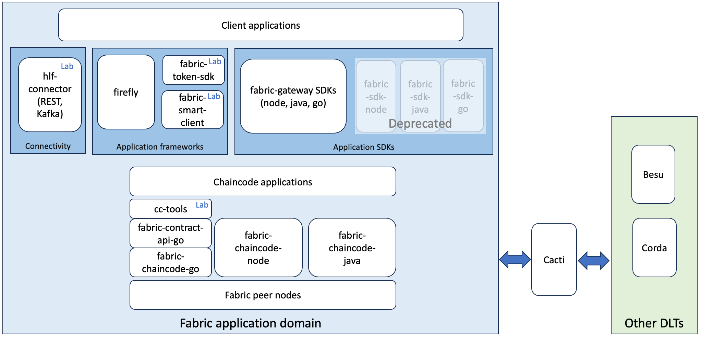

# Hyperledger Fabric

A `blockchain` is an immutable transaction ledger, maintained within a distributed network of `peer nodes`. Each node maintains a copy of the ledger and applies `transactions` that have been validated by a `consensus` protocol. Each block of transactions is then grouped into `blocks` that include a hash that `binds` each block to the `previous block`.

`Bitcoin` and `Ethereum` classify as `public permissionless` blockchain technology. Basically, these are public networks, open to anyone, where participants interact anonymously.

`Hyperledger Fabric` is an open-source, `permissioned blockchain`. It has a `modular` architecture that delivers high degrees of confidentiality, flexibility, resiliency, and scalability. It's designed to support pluggable implementations of different components.

In a `permissioned network`, participants are `identified` and `known` to each other, unlike with a `public permissionless` network where the participants remain anonymous.

* [Why Hyperledger Fabric?](#why-hyperledger-fabric)
* [Ecosystem](#ecosystem)
* [Consensus](#consensus)
* [Shared Ledger](#shared-ledger)
* [Chaincode](#chaincode)
* [Privacy and Confidentiality](#privacy-and-confidentiality)
* [Permissions and Access Control](#permissions-and-access-control)
* [Getting Started](#getting-started)
* [Reference](#reference)

## Why Hyperledger Fabric?

For enterprise use, we need to consider the following requirements:

* Participants must be identified/identifiable
* Networks need to be permissioned
* High transaction throughput performance
* Low latency of transaction confirmation
* Privacy and confidentiality of transactions and data pertaining to business transactions

One of the most important of the `platform’s differentiators` is its support for `pluggable consensus protocols` that enable the platform to be more effectively customized to fit particular use cases and trust models.

`Fabric` can use consensus protocols that do not require a `native cryptocurrency` to motivate expensive mining or smart contract execution.

**Hyperledger Fabric** has been specifically architected to have a `modular` architecture. Whether it is `consensus`, `identity` management protocols, `key` management protocols or `cryptographic` libraries, the platform has been designed at its core to be configured to meet the diversity of enterprise use case requirements

## Ecosystem

## Consensus

The process of keeping the ledger transactions synchronized across the network — to ensure that ledgers update only when transactions are approved by the appropriate participants, and that when ledgers do update, they update with the same transactions in the same order — is called consensus.

Transactions must be written to the ledger in the order in which they occur, even though they might be between different sets of participants within the network

Hyperledger Fabric offers `Raft crash fault tolerant (CFT)`, a `BFT` consensus and as of Version 3 `SmartBFT` consensus.
You can also write your own consensus algorithm. Consider using the `BFT` or `SmartBFT` if true decentralization is required.

## Shared Ledger

`Hyperledger Fabric` has a ledger subsystem comprising two components: the `world state` and the `transaction log`. Each participant has a copy of the ledger to every Hyperledger Fabric network they belong to.

The `world state` component describes the `state of the ledger` at a given point in time. It’s the database of the ledger. The `transaction log` component records all transactions which have `resulted in the current value of the world state`; it’s the update history for the world state. `The ledger`, then, is a `combination` of the `world state database` and the `transaction log` history.

The ledger has a `replaceable data store` for the world state. By default, this is a `LevelDB key-value` store database. The transaction log does not need to be pluggable. It simply records the before and after values of the ledger database being used by the blockchain network.

## Chaincode

`Hyperledger Fabric` `smart contracts` are written in `chaincode` and are invoked by an application external to the blockchain when that application needs to interact with the ledger

`chaincode` (Smart contracts) run within a container environment (e.g. Docker) for isolation. They can be written in standard programming languages.

In `Fabric`, an application-specific endorsement policy specifies which peer nodes, or how many of them, need to vouch for the correct execution of a given smart contract. Thus, each transaction need only be executed (endorsed) by the subset of the peer nodes necessary to satisfy the transaction’s endorsement policy. This allows for parallel execution increasing overall performance and scale of the system.

## Privacy and Confidentiality

Hyperledger Fabric, enables confidentiality through its `channel` architecture and private data feature. In channels, participants on a Fabric network establish a `sub-network` where every member has visibility to a `particular set` of transactions. Thus, only those nodes that participate in a channel have access to the chaincode and data transacted, preserving the privacy and confidentiality of both. Private data allows collections between members on a channel, allowing much of the same protection as channels without the maintenance overhead of creating and maintaining a separate channel.

## Permissions and Access Control

The different actors in a blockchain network include `peers`, `orderers`, `client applications`, `administrators` and more. Each of these actors has a `digital identity` encapsulated in an `X.509 digital certificate`. These identities matter because they determine the exact `permissions` over `resources` and `access` to `information` that actors have in a blockchain network.  
For an identity to be `verifiable`, it must come from a `trusted authority`. A membership service provider (MSP) is that trusted authority in Fabric.

A `Certificate Revocation List (CRL)` is easy to understand — it’s just a list of references to certificates that a CA knows to be revoked for one reason or another.  
When a third party wants to verify another party’s identity, it first checks the issuing CA’s CRL to make sure that the certificate has not been revoked

## Getting Started

Start with the [Getting Start](./Getting%20Start.md)

## Reference

* <https://github.com/hyperledger/fabric>
* <https://wiki.hyperledger.org/>
* <https://wiki.hyperledger.org/display/fabric/Ecosystem>
* <https://www.youtube.com/channel/UC7_X0WkMtkWzaVUKF-PRBNQ>
* <https://www.youtube.com/@Hyperledger>
* <https://hyperledger-fabric.readthedocs.io/en/latest/index.html>
* <https://www.hyperledger.org/learn/training>
