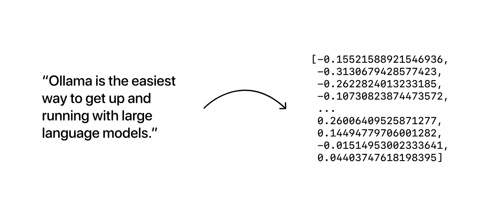

# Ollama

Ollama is an open-source AI model server. It can get and run large language models (LLMs) locally on your machine.

## Install

```bash
curl -fsSL https://ollama.com/install.sh | sh

# Run a model
ollama run llama3.1:8b

# List models
ollama list

# Model Info
ollama show llama3.1:8b
#   Model
#         arch                    llama
#         parameters              8.0B
#         quantization            Q4_0
#         context length          131072
#         embedding length        4096

#   Parameters
#         stop    "<|start_header_id|>"
#         stop    "<|end_header_id|>"
#         stop    "<|eot_id|>"
```

## Files

Ollama files in Linux are located here:

```bash
/home/mlibre/.ollama
/usr/local/bin/ollama
/usr/share/ollama
/etc/systemd/system/ollama.service
/etc/systemd/system/default.target.wants/ollama.service
```

## Costomizing Model

```bash
nano Modelfile

FROM llama3.1:8b

SYSTEM """
You are Mario from Super Mario Bros. Answer as Mario, only. And Always start your answer with HAYAYAYA
"""
```

```bash
ollama create mario -f ./Modelfile
ollama run mario
```

## Embedding models

Ollama supports embedding models, making it possible to build retrieval augmented generation (RAG) applications that combine text prompts with existing documents or other data.

Embedding models are models that are trained specifically to generate vector embeddings.



The resulting vector embedding arrays can then be stored in a database, which will compare them as a way to search for data that is similar in meaning

### Installation

```bash
ollama pull mxbai-embed-large
```

### Usage

```bash
curl http://localhost:11434/api/embeddings -d '{
  "model": "mxbai-embed-large",
  "prompt": "Llamas are members of the camelid family"
}'
```

## Reference

* <https://ollama.com/>
